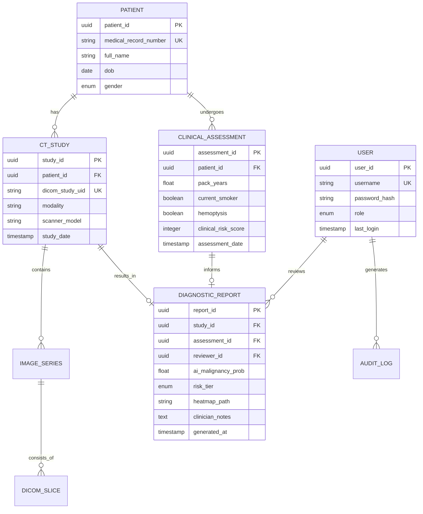

# 6. Database Design (Schema Specification)

This section details the relational database structure designed to support the AuraScan (Lung Cancer V2) platform. The schema is optimized for clinical data integrity, patient privacy (HIPAA compliance), and high-performance retrieval of volumetric imaging metadata.

---

### 6.1 Entity Relationship Diagram (ERD)

The following diagram illustrates the logical relationships between core entities.

---

### 6.2 Data Dictionary

#### 6.2.1 Table: Patients
Stores core demographic information. Access to this table is restricted to authorized medical personnel only.

| Column | Type | Constraints | Description |
| :--- | :--- | :--- | :--- |
| `patient_id` | UUID | PK | Unique internal identifier. |
| `mrn` | VARCHAR(50) | UNIQUE, NOT NULL | Hospital Medical Record Number. |
| `full_name` | VARCHAR(255) | NOT NULL | Patient's legal name. |
| `dob` | DATE | NOT NULL | Date of birth for age calculation. |
| `gender` | ENUM | ('M', 'F', 'O') | Biological sex. |

#### 6.2.2 Table: Clinical_Assessments
Captures the clinical markers used by the Risk Engine.

| Column | Type | Constraints | Description |
| :--- | :--- | :--- | :--- |
| `assessment_id` | UUID | PK | Unique identifier for the intake. |
| `patient_id` | UUID | FK | Reference to Patients table. |
| `pack_years` | FLOAT | DEFAULT 0 | Cumulative smoking history. |
| `hemoptysis` | BOOLEAN | NOT NULL | Presence of coughing blood. |
| `chest_pain` | BOOLEAN | NOT NULL | Presence of thoracic pain. |
| `clinical_score` | INT | NOT NULL | Calculated score from risk logic. |

#### 6.2.3 Table: CT_Studies
Metadata for imaging procedures retrieved from PACS.

| Column | Type | Constraints | Description |
| :--- | :--- | :--- | :--- |
| `study_id` | UUID | PK | Unique internal identifier. |
| `study_uid` | VARCHAR(255) | UNIQUE | Global DICOM Study Instance UID. |
| `patient_id` | UUID | FK | Reference to Patients table. |
| `scanner_make` | VARCHAR(100) | | Manufacturer (e.g., GE, Siemens). |
| `slice_count` | INT | | Total number of slices in the volume. |

#### 6.2.4 Table: Diagnostic_Reports
The final output combining AI analysis and clinical validation.

| Column | Type | Constraints | Description |
| :--- | :--- | :--- | :--- |
| `report_id` | UUID | PK | Unique report identifier. |
| `study_id` | UUID | FK | Reference to the analyzed scan. |
| `ai_prob` | DECIMAL(5,4) | | AI-predicted malignancy probability. |
| `risk_tier` | VARCHAR(20) | | Categorization (Low/Mod/High). |
| `heatmap_uri` | TEXT | | Path to the XAI visualization file. |
| `status` | ENUM | | (Draft, Finalized, Amended). |

---

### 6.3 Design Rationale

1.  **UUID Primary Keys**: Used instead of auto-incrementing integers to ensure data can be merged across multiple hospital sites without ID collisions and to obscure record counts for security.
2.  **Auditability**: Every diagnostic decision is linked to a `user_id` and a `timestamp`. An auxiliary `Audit_Logs` table (not fully detailed here) tracks all read/write operations on PHI.
3.  **Normalization**: Clinical assessment data is decoupled from patient demographics. This allows for multiple longitudinal assessments of the same patient over time.
4.  **File System Offloading**: High-bandwidth data like 3D Heatmaps and DICOM slices are stored in a secured object store/file system, with the database only maintaining the URI (Uniform Resource Identifier) to optimize query performance.
5.  **HIPAA Compliance**: The schema supports data de-identification by allowing the decoupling of `patient_id` from medical identifiers in a secure research view.

---
*Technical documentation for AuraScan Database Infrastructure.*
