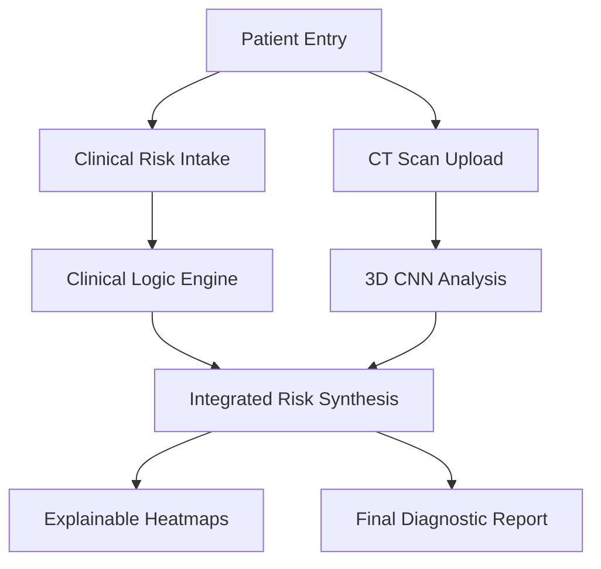
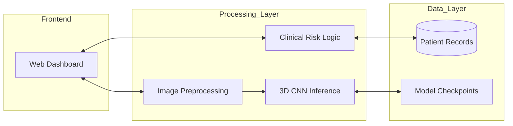
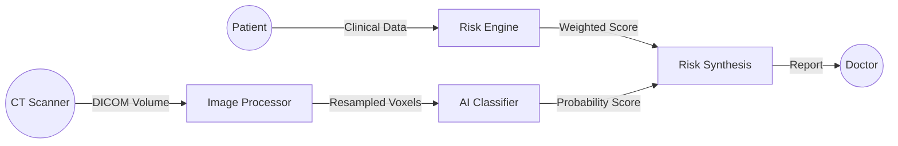
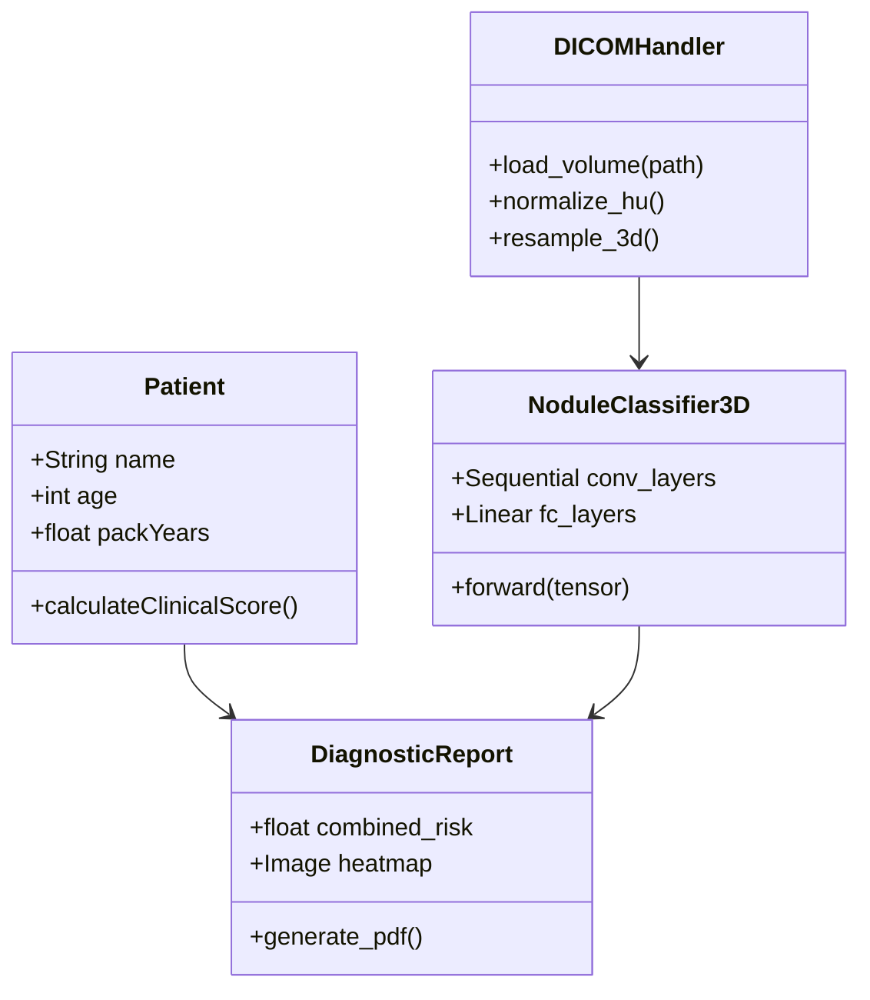
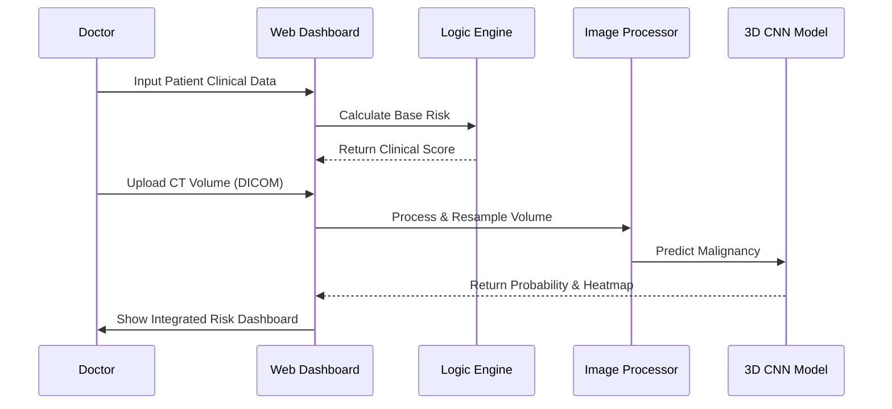

# 5. System Design and Architecture

This section provides the structural and behavioral diagrams for the AuraScan (Lung Cancer V2) system. To view or edit these diagrams, copy the code blocks below into the [Mermaid Live Editor](https://mermaid.live/).

---

### 5.1.1 Proposed System
The proposed system integrates clinical risk scoring with 3D Deep Learning image analysis. It transitions from a manual, subjective interpretation to an augmented, data-driven diagnostic workflow.



---

### 5.1.2 Block Diagram
A high-level view of the functional blocks within the system.



---

### 5.1.3 Component Diagram
Detailed software components and their interfaces.

```mermaid
component "AuraScan Core" {
  [UI Controller] -- "Data Objects" --> [Logic Hub]
  [Logic Hub] --> [Risk Scorer]
  [Logic Hub] --> [AI Pipeline]
  [AI Pipeline] --> [DICOM Handler]
  [AI Pipeline] --> [3D CNN Model]
  [3D CNN Model] --> [XAI Engine]
}
```

---

### 5.1.4 Use Case Diagram
Interaction between clinical actors and the system.

```mermaid
useCaseDiagram
    actor Clinician
    actor "Hospital Admin" as Admin
    actor "AI Model" as AI
    
    package "AuraScan System" {
        usecase "Input Patient Data" as UC1
        usecase "Upload CT Scan" as UC2
        usecase "View Risk Analysis" as UC3
        usecase "Generate Report" as UC4
        usecase "Audit Logs" as UC5
    }
    
    Clinician --> UC1
    Clinician --> UC2
    Clinician --> UC3
    Clinician --> UC4
    UC2 --> AI
    AI --> UC3
    Admin --> UC5
```

---

### 5.1.5 Data Flow Diagram (DFD)
The flow of information from raw input to diagnostic output.



---

### 5.1.6 Class Diagram
The underlying data structures and class relationships in the Python implementation.



---

### 5.1.7 Sequence Diagram
The step-by-step diagnostic workflow for a single patient session.



---
*Diagrams generated for the AuraScan (Lung Cancer V2) technical specification.*
